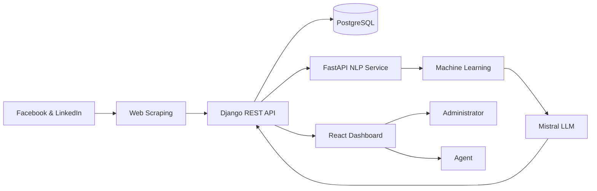

<div align="center">

# 🧠 Smart Complaint Management Platform

### AI-Powered Platform for Intelligent Complaint Collection, Classification and Management

🎓 **Final Year Project (Bachelor's Degree in Computer Science & Multimedia)**  
**ISAMM – Higher Institute of Multimedia Arts of Manouba**  
Academic Year **2025–2026**

Developed in collaboration with **MAE Assurances**

<br>


</div>

---

# 📖 About the Project

The **Smart Complaint Management Platform** is an intelligent web application developed for **MAE Assurances** to automate the collection, analysis, classification and management of customer complaints from social media platforms.

Traditional complaint management is often manual, time-consuming and inefficient. This platform leverages **Artificial Intelligence**, **Machine Learning** and **Natural Language Processing (NLP)** to automatically identify complaints, predict their category and urgency, and assist agents through an interactive dashboard.

The solution combines modern web technologies with intelligent decision-making to improve complaint processing efficiency and customer satisfaction.

---

# 🎯 Project Objectives

- 📥 Collect customer feedback from multiple online sources.
- 🤖 Detect whether a comment is a complaint.
- 🧠 Automatically classify complaints using AI models.
- 🚨 Predict complaint urgency.
- 📊 Provide interactive dashboards and analytics.
- 👥 Facilitate complaint management for agents and administrators.
- ⚡ Reduce manual processing time.

---

# ✨ Key Features

## 🔐 Authentication & User Management

- Secure login
- JWT Authentication
- Role-based access control
- Administrator & Agent interfaces

---

## 📥 Automatic Data Collection

- Facebook scraping
- LinkedIn scraping
- Automatic data synchronization

---

## 🤖 Intelligent Complaint Analysis

- Complaint Detection
- Complaint Classification
- Urgency Prediction
- Hybrid AI Decision System
- LLM-assisted validation

---

## 📋 Complaint Management

- View detected complaints
- Search & filtering
- Complaint details
- Status tracking
- Internal notes
- Manual reclassification

---

## 📊 Dashboard & Business Intelligence

- Complaint statistics
- Source distribution
- Category analytics
- Urgency visualization
- KPI Dashboard
- Interactive charts

---

# 📷 Application Preview

> 📸 Screenshots will be added soon.

| Login | Dashboard |
|-------|-----------|
| Coming Soon | Coming Soon |

| Complaints | Statistics |
|------------|------------|
| Coming Soon | Coming Soon |

---

# 🚀 Why this project?

This project demonstrates practical skills in:

- Full Stack Web Development
- REST API Design
- Artificial Intelligence
- Natural Language Processing
- Machine Learning
- Database Design
- Data Visualization
- Software Engineering
---

# 🏗️ System Architecture

The platform follows a modular architecture composed of five main layers:



The application is composed of:

- **React** interactive dashboard
- **Django REST Framework** backend
- **FastAPI** intelligent prediction service
- **Machine Learning** classification module
- **LLM (Mistral via Ollama)** for AI-assisted validation
- **PostgreSQL** database
- **Web Scraping** pipeline for social media collection

---

# 🤖 Artificial Intelligence Module

The intelligent module combines Machine Learning and Large Language Models to improve complaint analysis.

## AI Workflow

1. Customer comments are collected.
2. The text is cleaned and preprocessed.
3. A Machine Learning model predicts:
   - Complaint detection
   - Complaint category
   - Urgency level
4. If confidence is low, the request is sent to **Mistral (via Ollama)**.
5. The prediction is validated before being returned to the application.

This hybrid approach improves both prediction accuracy and reliability.

---

# 🛠️ Technology Stack

| Category | Technologies |
|-----------|--------------|
| Frontend | React.js, HTML5, CSS3, JavaScript |
| Backend | Django REST Framework, FastAPI |
| Database | PostgreSQL |
| AI & NLP | Scikit-Learn, Pandas, Machine Learning, NLP, Mistral, Ollama |
| Data Collection | Web Scraping |
| Tools | Git, GitHub, Visual Paradigm |

---

# 📂 Project Structure

```text
mae2/
│
├── backend/
│   ├── authentication/
│   ├── complaints/
│   ├── dashboard/
│   ├── scraping/
│   ├── api/
│   └── settings/
│
├── frontend-reclamations/
│   ├── src/
│   ├── components/
│   ├── pages/
│   ├── services/
│   └── assets/
│
├── README.md
└── .gitignore
```

---

# 🔐 Security Features

- JWT Authentication
- Role-Based Access Control
- Protected REST APIs
- Secure password management
- Authentication middleware

---

# ⚙️ Installation

## Clone the repository

```bash
git clone https://github.com/molka-hammami/mae2.git
```

---

## Backend

```bash
cd backend

pip install -r requirements.txt

python manage.py migrate

python manage.py runserver
```

---

## FastAPI AI Service

```bash
uvicorn main:app --reload
```

---

## Frontend

```bash
cd frontend-reclamations

npm install

npm run dev
```

---

# 🚀 Usage

1. Log in as an administrator or agent.

2. Collect comments from supported social media sources.

3. Run the AI analysis pipeline.

4. Review automatically classified complaints.

5. Manage complaint status.

6. Monitor KPIs and analytics through the dashboard.
---

# 📊 Project Results

The Smart Complaint Management Platform successfully demonstrates the integration of modern web technologies with Artificial Intelligence to improve complaint management.

## Achievements

- ✅ Automated complaint collection from social media
- ✅ Intelligent complaint detection and classification
- ✅ Urgency prediction using AI
- ✅ Interactive dashboard for complaint monitoring
- ✅ Role-based complaint management
- ✅ RESTful API architecture
- ✅ Business Intelligence visualizations
- ✅ Centralized PostgreSQL database

The project significantly reduces manual complaint processing while improving decision-making through intelligent analysis and interactive visualizations.

---

# 📈 Future Improvements

Several enhancements can be implemented in future versions of the platform:

- 🌍 Multi-language complaint analysis
- ☁️ Cloud deployment (AWS, Azure or Docker)
- 📱 Mobile application
- 🔔 Real-time notifications
- 📊 Advanced Business Intelligence dashboards
- 🤖 Fine-tuned AI models
- 🌐 Integration with additional social media platforms
- 📈 Predictive analytics and reporting

---

# 🎓 Academic Context

This project was developed as a **Bachelor's Final Year Project** at the **Higher Institute of Multimedia Arts of Manouba (ISAMM)** in collaboration with **MAE Assurances**.

It combines concepts from:

- Artificial Intelligence
- Natural Language Processing
- Machine Learning
- Full Stack Development
- Software Engineering
- Business Intelligence

---

# 👩‍💻 Authors

| Name | Role |
|------|------|
| **Molka Hammami** | Full Stack Developer |
| **Ranim Khemir** | Full Stack Developer |

### Academic Supervisor

**Mrs. Meriem Falleh**  
Higher Institute of Multimedia Arts of Manouba (ISAMM)

### Industrial Supervisors

- **Mrs. Emna Terzi** — MAE Assurances
- **Mr. Mohamed Salah Farah** — MAE Assurances

---

# 🙏 Acknowledgements

We would like to express our sincere gratitude to:

- **MAE Assurances** for providing the opportunity to work on this real-world project.
- **ISAMM** for the academic support and guidance.
- Our academic and industrial supervisors for their valuable advice and continuous encouragement throughout this project.

---

# 📚 References

- Django REST Framework
- FastAPI
- React.js
- PostgreSQL
- Scikit-Learn
- Pandas
- Mistral AI
- Ollama

---

# 📄 License

This repository is intended for **academic and portfolio purposes**.

© 2026 Molka Hammami & Ranim Khemir

---

<div align="center">

### ⭐ If you like this project, don't forget to leave a star!

Made with ❤️ using **React • Django • FastAPI • PostgreSQL • Machine Learning**

</div> 
